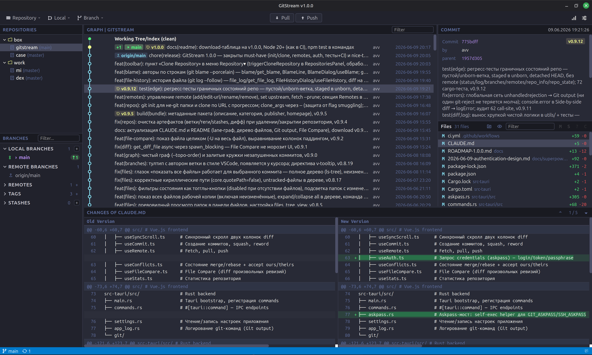

# GitStream

A desktop Git GUI focused on everyday Git workflows — commits, branches, push/pull, diff review — without blocking the UI or unnecessary complexity.



## Features

### File operations
- **Stage / Unstage / Discard** with a single click or via context menu
- File statuses: modified, added, deleted, renamed, untracked, conflicted
- **Tree view** of changed files with collapsible folders, expand/collapse all, and per-repo expansion memory
- **Show all files** toggle — list the entire working tree (including unchanged files) via `ls-tree`, with changed folders highlighted
- State filters as toggle buttons (modified / staged / untracked / …)
- Correct Cyrillic / non-ASCII paths (`core.quotePath=false`)
- **Unified** and **side-by-side** diff views with a toggle, synced scroll, and virtual list

### Commits
- Commit dialog with a file table and checkboxes — pick what to commit without manually touching the index
- Subject line length indicator (50/72)
- **Amend** to fix the last commit
- **Commit & Push** button — commit and push in one action
- **Partial stage** — select individual lines/hunks in the side-by-side diff, then stage/unstage/discard the selection
- **Multi-select** (Shift/Ctrl+click) for batch stage, unstage, commit, discard, or delete

### History
- Commit graph with **lane-allocated branch/merge lines** in colored columns (full-repo, topological order)
- Branches, tags, HEAD, and remote tracking shown on the graph
- Highlights unpushed commits (filled circles)
- Working Tree / Index row above the graph — double-click opens the commit dialog
- Selected commit details: author, date, message, changed files
- Filter commits by message, author, SHA, date, or ref name
- **File History** — commit log of a single file (`git log --follow`), its diff at the selected commit, and jump-to-commit in the graph
- **Blame** — per-line authorship (`git blame --porcelain`) with a commit/author/date gutter; click a line to jump to its commit

### Branches, tags, stash
- Local and remote branch list with ahead/behind indicators
- Checkout, rename, delete branches (including batch delete)
- Checkout a remote branch as a new local branch — upstream tracking set automatically
- Tags and stash entries in the left panel
- Create, delete, and push tags; batch delete/push selected tags
- Stash save (with message and `--include-untracked`), apply, pop, drop

### Remote operations
- **Pull** — merge or rebase, with remote selection; upstream configured automatically
- **Push** — always sets upstream on first push; force push only via `--force-with-lease`, guarded by a backup ref (`refs/gitstream/backup/<branch>`) so it can be undone — no silent destructive actions
- **Fetch** — fetch without integrating, as a split button next to Pull/Push: **Fetch** (default remote), **Fetch all** (`git fetch --all`), and **Fetch all (prune)**; per-remote Fetch / Fetch --prune from the Remotes section, plus a one-click Fetch all in its header
- **Sync Assistant** — when a push is rejected (non-fast-forward) it diagnoses the situation and offers safe one-click remedies: a rewritten-commit case (same tree, different SHA — amend/rebase) → force-with-lease; a genuine divergence → pull --rebase / merge
- **Auto-fetch on repository switch** — fetches once per repo per session so the graph immediately shows incoming (dimmed) commits and an accurate behind count, without blocking the UI
- **Remote management** — add / edit URL / rename / remove remotes (Remotes section in the Branches panel)
- **Set upstream** — pick the tracking branch for a local branch (or unset it)
- Network progress indicator with remote name and timeout countdown
- Configurable network timeout

### Authentication
- **In-app credential prompt** for HTTPS (login / token) and SSH key passphrase, via an askpass bridge — no silent hangs
- SSH host-key confirmation prompt
- **Remember** checkbox — enables a git credential helper so git persists credentials between operations
- Network timeout pauses while a credential dialog is open; cancelling a prompt is reported cleanly, not as a crash

### Merge / Rebase / Conflict resolution
- Merge branch, rebase branch onto branch
- Continue / Abort controls (ConflictBar) for merge, rebase, cherry-pick, revert
- Accept ours / Accept theirs per file

### Log operations
- Reset (soft / mixed / hard), Revert, Cherry-pick from the commit graph context menu
- Squash multiple commits, Reword commit message

### Repository manager
- Treeview of open repositories with folder grouping
- Folders (groups) kept sorted alphabetically; repositories keep their order
- Drag-and-drop: repos into groups, groups into groups
- Double-click to switch repository
- **Open / init** — add an existing repository or initialize a new one in an empty/non-Git folder (`git init`)
- **Clone** — clone a remote repository by URL into a chosen directory, with live progress
- Context menu: Add Repository, Clone Repository, Create Group, Delete

### Keyboard shortcuts
- **Ctrl+K** — open commit dialog
- **Ctrl+T** — stage selected files
- **Shift+Ctrl+T** — unstage selected files
- **Ctrl+M** — merge branch
- **Ctrl+D** — rebase branch
- **Ctrl+G** — checkout the selected remote branch
- **F7** — create branch
- **Shift+F7** — create tag
- **Ctrl+A** — select all files in the file panel
- **Alt+O / Ctrl+O** — toggle the Git output window
- **Alt+P** — toggle the parameters panel (layout-independent)
- **Esc** — close only the topmost dialog/window

### Interface
- Toolbar with **Repository▾**, **Local▾**, **Branch▾** dropdown menus and color-coded Pull/Fetch (greenish) / Push (reddish) buttons in the center
- **Git output** window — timestamped log of executed git commands and their errors
- **Settings**, **Stats**, and **File Compare** (diff any two revisions of a file) dialogs
- Branch author tooltip (VSCode-style) on hover
- Binary-file and image preview in the diff panel
- **Multiple light and dark themes** — System (follows the OS), Dark+ (VSCode), Light, Material / Material Light, SmartGit, Catppuccin Mocha / Latte, Solarized Light, GitHub Dark / Light, Dracula, Sublime (Monokai Pro)
- Draggable modal dialogs
- Resizable panels
- Status bar: current branch, ahead/behind, operation progress
- Auto-update with an in-app banner
- i18n: Russian / English

## Tech stack

- **Frontend:** Vue 3 (Composition API) + TypeScript + Vite
- **Backend:** Tauri 2 (Rust)
- **Git:** git CLI under the hood, `--porcelain` / `--format` parsing

## Download

Latest release with binaries for all platforms: **v1.1.4**

| Platform | Package | Link |
|----------|---------|------|
| Linux | `.deb` (Debian / Ubuntu) | [GitStream_1.1.4_amd64.deb](https://github.com/avv7bc/gitstream/releases/download/v1.1.4/GitStream_1.1.4_amd64.deb) |
| Linux | `.rpm` (Fedora / RHEL) | [GitStream-1.1.4-1.x86_64.rpm](https://github.com/avv7bc/gitstream/releases/download/v1.1.4/GitStream-1.1.4-1.x86_64.rpm) |
| Linux | `.AppImage` | [GitStream_1.1.4_amd64.AppImage](https://github.com/avv7bc/gitstream/releases/download/v1.1.4/GitStream_1.1.4_amd64.AppImage) |
| macOS | `.dmg` (Apple Silicon) | [GitStream_1.1.4_aarch64.dmg](https://github.com/avv7bc/gitstream/releases/download/v1.1.4/GitStream_1.1.4_aarch64.dmg) |
| Windows | `.exe` installer | [GitStream_1.1.4_x64-setup.exe](https://github.com/avv7bc/gitstream/releases/download/v1.1.4/GitStream_1.1.4_x64-setup.exe) |
| Windows | `.msi` | [GitStream_1.1.4_x64_en-US.msi](https://github.com/avv7bc/gitstream/releases/download/v1.1.4/GitStream_1.1.4_x64_en-US.msi) |

All releases: [github.com/avv7bc/gitstream/releases](https://github.com/avv7bc/gitstream/releases)

### macOS: "GitStream is damaged and can't be opened"

The macOS build is **not signed with an Apple Developer ID and not notarized**, so after downloading the `.dmg` via a browser, Gatekeeper marks the app as "damaged" (the `com.apple.quarantine` attribute). This is expected — the app is fine. To run it, copy `GitStream.app` to `/Applications` and strip the quarantine attribute:

```bash
xattr -dr com.apple.quarantine /Applications/GitStream.app
```

Then open the app normally.

## Getting started

### Prerequisites

- **Git** — must be in `PATH` (GitStream calls `git` directly)
- **Node.js** 20+ and **npm**
- **Rust toolchain** — install via [rustup.rs](https://rustup.rs/)
- **Tauri system dependencies** — see the [official prerequisites guide](https://tauri.app/start/prerequisites/):
  - **Linux:** `webkit2gtk`, `libgtk-3-dev`, `libayatana-appindicator3-dev`, `librsvg2-dev`, `build-essential`
  - **macOS:** Xcode Command Line Tools
  - **Windows:** Microsoft Visual Studio C++ Build Tools + WebView2

### Quick start (automatic)

The included `start.sh` script checks all dependencies, installs missing ones (Rust via rustup, system packages via the system package manager), and launches the app:

```bash
./start.sh          # development mode
./start.sh build    # production build
```

Supports apt, dnf, pacman, zypper, and macOS. Asks for confirmation before each installation step.

### Manual setup

```bash
git clone <repo-url> gitstream
cd gitstream
npm install
```

### Development mode

Starts the Vite dev server and Tauri with hot reload:

```bash
npm run tauri dev
```

The first run is slow — Rust compiles all dependencies. Subsequent runs are fast.

### Production build

Builds an optimized bundle and a native installer for the current platform:

```bash
npm run tauri build
```

Output:
- **Linux:** `src-tauri/target/release/bundle/{deb,rpm,appimage}/`
- **macOS:** `src-tauri/target/release/bundle/{dmg,macos}/`
- **Windows:** `src-tauri/target/release/bundle/{msi,nsis}/`

### First run

1. Open the app — you'll see an empty repository manager on the left
2. Right-click in the `Repositories` panel → `Add Repository` → select a local Git repository path
3. Double-click a repository to switch to it

### Useful commands

```bash
npm run dev          # Vite only (no Tauri, for UI debugging)
npm run build        # type-check + build frontend
npm test             # run frontend unit tests (Vitest)
npx vue-tsc --noEmit # TypeScript check without building
```

## License

[MIT](LICENSE)
